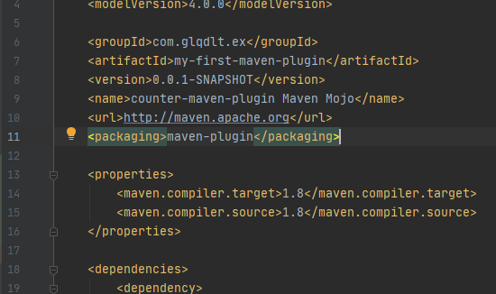

```xml
 <build>
        <plugins>
            <plugin>
                <groupId>com.glqdlt.ex</groupId>
                <artifactId>my-first-maven-plugin</artifactId>
                <version>0.0.1-SNAPSHOT</version>
                <executions>
                    <execution>
                        <goals>
                            <goal>compile-before-resource-copy</goal>
                        </goals>
                    </execution>
                </executions>
                <configuration>
                    <in>
                        C:/Users/user/Desktop/0.PNG
                    </in>
                    <out>
                        ${project.basedir}/src/main/resources/0.PNG
                    </out>
                </configuration>
            </plugin>
            
        </plugins>
</build>
```


### 주의사항

아티팩트 패키징 유형을 maven-plugin 으로 해야한다.




